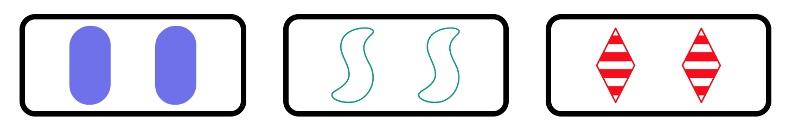

# Set Game Project Notes
Project Overview
A web-based implementation of the Set card game where players need to find combinations of three cards that follow specific rules.

### Rules of Set
This assignment is inspired by the classic SET! Card game. A game consists of a board of cards. Each card has one of three options for 4 different "attributes":

| Attribute | **Options**  | | |
|-------    |---------|---------|----------|
| STYLE     | solid   | outline | striped  |
| COLOR     | green   | purple  | red      |
| SHAPE     | diamond | oval    | squiggle |
| COUNT     | 1       | 2       | 3        |

The goal of the game is to find as many "Sets" of 3 cards such that for each attribute, all cards share the attribute or no cards share the attribute. For example, the following three cards build a Set because none share style, color, or shape attributes but they all share the count attribute.

  

However, the following three cards do not form a Set since the color attribute does not follow the "all or none" requirement (purple is shared by the first and third card, but not the second).

  

## Technology Stack
HTML: Page structure (provided)
CSS: Page styling (provided)
JavaScript: Game logic and interaction implementation
## Game Features
1. Game Modes
* Easy Mode: 9 cards, style fixed to solid
* Standard Mode: 12 cards, all attributes random
2. Timer Function
* Selectable game duration
* Countdown display (MM:SS format)
* Automatic game end when time runs out
3. Card System
Each card has 4 attributes:

* Style: solid/outline/striped
* Color: green/purple/red
* Shape: diamond/oval/squiggle
* Count: 1/2/3
4. Game Interactions
* Card Selection: Click to select/deselect
* Set Validation: Automatic check when three cards are selected
* Instant Feedback: Shows "SET!" or "Not a Set" prompt
* Scoring System: Tracks number of Sets found
* Refresh Function: Can regenerate card layout
5. View Switching
* Main Menu View: Select difficulty and time
* Game View: Display cards and game status
## Core Function Implementation
* toggleViews(): Switch between menu and game views
* generateRandomAttributes(): Generate random card attributes
* generateUniqueCard(): Create unique card elements
* startTimer(): Start game timer
* advanceTimer(): Update timer display
* cardSelected(): Handle card selection logic
## Development Guidelines
1. Code Standards:
* JavaScript module pattern
* Strict mode ("use strict")
* Camel case naming convention
* JSDoc comment standards
2. Performance Optimization:
* Minimize global variables
* Clean up timers properly
* Avoid redundant DOM operations
3. User Experience:
* Clear game state feedback
* Smooth animations
* Intuitive operations